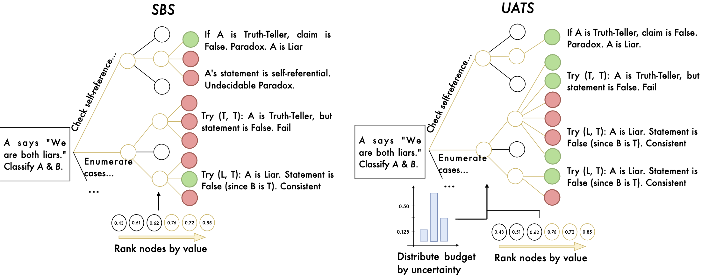
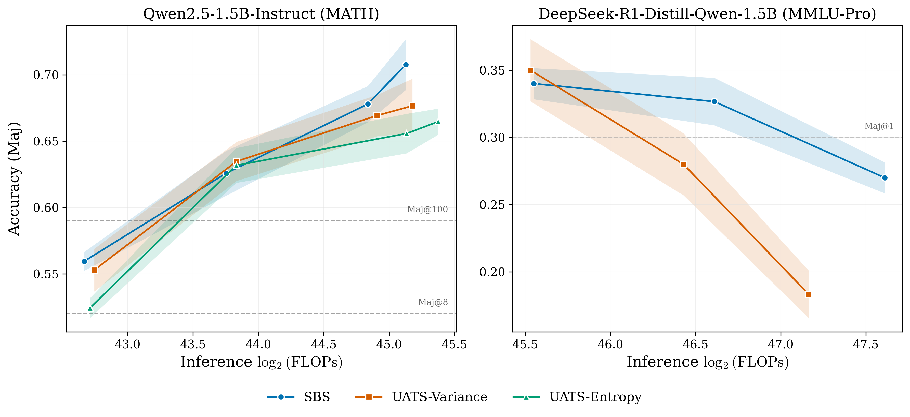

# Process Uncertainty Models & UATS

Code for the paper [**"Challenges in Inference Time Scaling with Uncertainty Aware Tree Search"**](https:// ) (ICLR 2026 Workshops).

This repository studies how **process uncertainty models (PUMs)** interact with **process reward models (PRMs)** during inference-time search. We introduce **Uncertainty-Aware Tree Search (UATS)**, which dynamically allocates search compute based on predicted uncertainty in reasoning steps.

## Overview

Inference-time search improves reasoning by exploring multiple chains of thought and ranking them with **process reward models (PRMs)**.

However, as search depth increases, models often explore **out-of-distribution trajectories** that receive spuriously high rewards.

We investigate whether **uncertainty estimates over PRM predictions** can mitigate this issue.

Our approach:

- **Process Uncertainty Model (PUM):** predicts uncertainty for intermediate reasoning steps  
- **Uncertainty-Aware Tree Search (UATS):** allocates expansion budget based on predicted uncertainty

Empirically, although PUMs work well on held-out traces, **uncertainty-guided search does not improve performance and can degrade it under distribution shift**.




---

## Installation

```bash
...